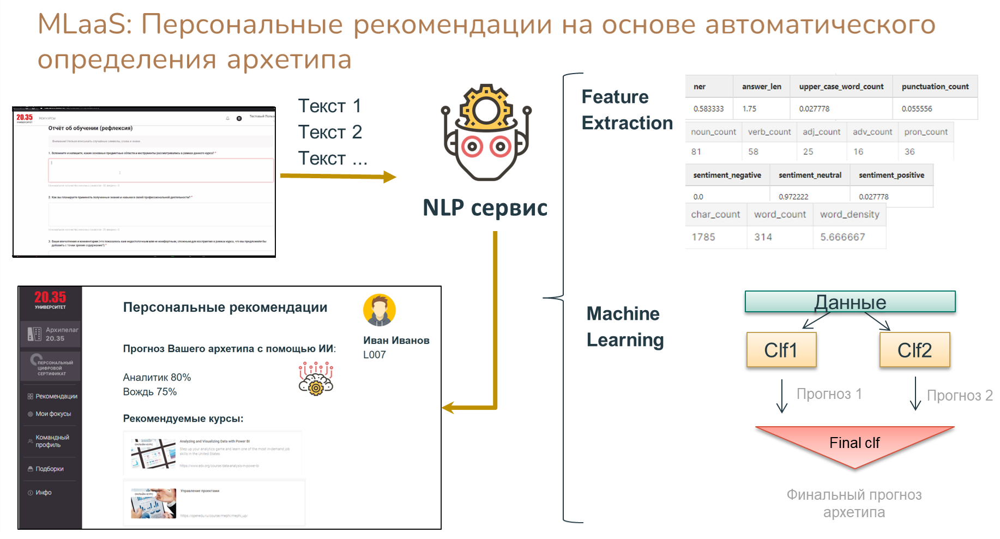

## 1st place solution for a [data science championship 2020](https://online.innoagency.ru/datascience/)
Case by University 20.35: building a machine learning model to predict personality traits based on textual data.

## Команда НеИИ. Кейс Университет 20.35

Основные моменты решения и результаты отражены в [Презентации.pdf](https://github.com/maya-ami/project2035/blob/master/%D0%9F%D1%80%D0%B5%D0%B7%D0%B5%D0%BD%D1%82%D0%B0%D1%86%D0%B8%D1%8F.pdf)

Демо разработанного NLP сервиса (прогноз архетипа и рекомендация релевантных курсов) - [nlp_serivce/demo.mp4](https://github.com/maya-ami/project2035/blob/master/nlp_service/demo.mp4)

__Для жюри__: выжимка результатов проекта по каждому из 15 критериев оценки - [CRITERIA.md](https://github.com/maya-ami/project2035/blob/master/CRITERIA.md)

## Техническая реализация представлена пошагово в файлах:

- Подготовка данных - [1 Prepare Data.ipynb](https://github.com/maya-ami/project2035/blob/master/1_Prepare_Data.ipynb)

- Работа с доп.данными - [2 Additional Data.ipynb](https://github.com/maya-ami/project2035/blob/master/2_Additional_Data.ipynb)

- Генерация признаков - [3 Feature Generation.ipynb](https://github.com/maya-ami/project2035/blob/master/3_Feature_Generation.ipynb)

- Анализ N грамм - [4 Analysing N Grams.ipynb](https://github.com/maya-ami/project2035/blob/master/4_Analysing_N_Grams.ipynb)

- Поиск корреляций - [5 Correlations.ipynb](https://github.com/maya-ami/project2035/blob/master/5_Correlations.ipynb)

- Модель классификации "Определение архетипа по текстовым данным" - [6 Model Classifier.ipynb](https://github.com/maya-ami/project2035/blob/master/6_Model_Classifier.ipynb)

- Модель регрессии "Прогноз значений ключевых мотиваторов учащихся" - [7 Model Regressor.ipynb](https://github.com/maya-ami/project2035/blob/master/7_Model_Regressor.ipynb)

- Создание признаков на основе тематического моделирования - [Topic Modleing.ipynb](https://github.com/maya-ami/project2035/blob/master/Topic_Modeling.ipynb)

NB: для прогона ноутбуков не по порядку, скопировать сформированные промежуточные датасеты из директории `data` в корень.
NB: протестировано только на ОС Windows.

## MLaaS: NLP service

Сервис определяет архетип обучающегося на основе текстов и рекомендует релевантные курсы.



### Запуск сервиса

```
cd nlp_service
pip install -r requirements.txt
python app.py
```

Прототип доступен в браузере по адресу http://127.0.0.1:5000/

NB: протестировано только на ОС Windows.

## Misc

Папка `data` содержит промежуточные датасеты, сгенерированные на каждом из шагов (агрегаты, текстовые фичи и пр.)

Код для ответов на вопросы анкеты - [Questionary_Answers.ipynb](https://github.com/maya-ami/project2035/blob/master/Questionary_Answers.ipynb)
